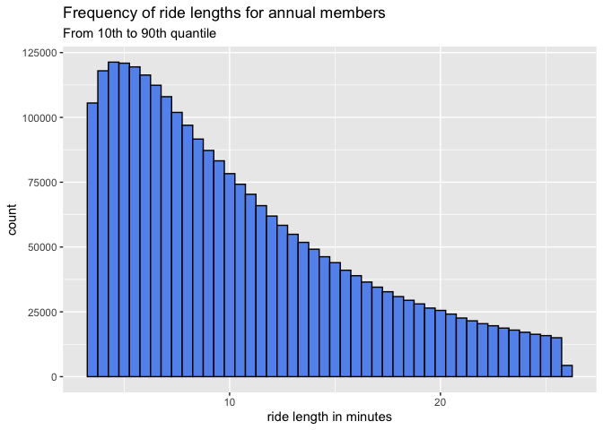
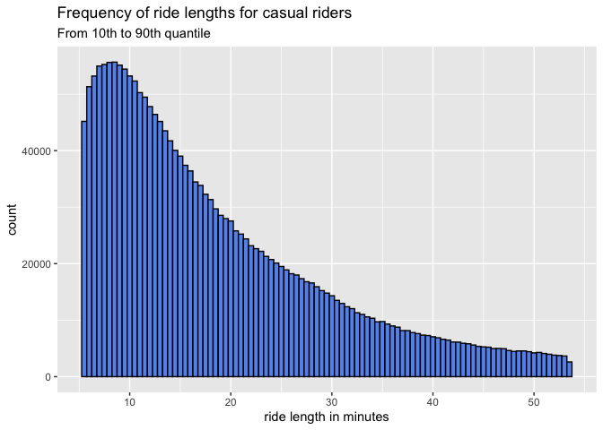

Analyze & Share
================
kk
2022-05-19

## Analyze and share

``` r
## read merged file from summary csv created in last step
getwd()
```

    ## [1] "/Users/kat/Dev/Google-Data-Analytics-R/bike-sharing-capstone"

``` r
library(readr)
library(tidyverse)
```

    ## ── Attaching packages ─────────────────────────────────────── tidyverse 1.3.1 ──

    ## ✔ ggplot2 3.3.6     ✔ dplyr   1.0.9
    ## ✔ tibble  3.1.7     ✔ stringr 1.4.0
    ## ✔ tidyr   1.2.0     ✔ forcats 0.5.1
    ## ✔ purrr   0.3.4

    ## ── Conflicts ────────────────────────────────────────── tidyverse_conflicts() ──
    ## ✖ dplyr::filter() masks stats::filter()
    ## ✖ dplyr::lag()    masks stats::lag()

``` r
df <- read_csv("output-data/allbikedata-clean_onlyvalidridelength.csv")
```

    ## Rows: 5757322 Columns: 18

    ## ── Column specification ────────────────────────────────────────────────────────
    ## Delimiter: ","
    ## chr  (10): column_label, ride_id, rideable_type, start_station_name, start_s...
    ## dbl   (6): start_lat, start_lng, end_lat, end_lng, ride_length, ride_length_num
    ## dttm  (2): started_at, ended_at
    ## 
    ## ℹ Use `spec()` to retrieve the full column specification for this data.
    ## ℹ Specify the column types or set `show_col_types = FALSE` to quiet this message.

\###**Some descriptive statistics:**

``` r
## some descriptive stats
library(skimr)
skim(df)
```

|                                                  |         |
|:-------------------------------------------------|:--------|
| Name                                             | df      |
| Number of rows                                   | 5757322 |
| Number of columns                                | 18      |
| \_\_\_\_\_\_\_\_\_\_\_\_\_\_\_\_\_\_\_\_\_\_\_   |         |
| Column type frequency:                           |         |
| character                                        | 10      |
| numeric                                          | 6       |
| POSIXct                                          | 2       |
| \_\_\_\_\_\_\_\_\_\_\_\_\_\_\_\_\_\_\_\_\_\_\_\_ |         |
| Group variables                                  | None    |

Data summary

**Variable type: character**

| skim_variable      | n_missing | complete_rate | min | max | empty | n_unique | whitespace |
|:-------------------|----------:|--------------:|----:|----:|------:|---------:|-----------:|
| column_label       |         0 |          1.00 |   8 |   8 |     0 |       12 |          0 |
| ride_id            |         0 |          1.00 |  16 |  16 |     0 |  5757322 |          0 |
| rideable_type      |         0 |          1.00 |  11 |  13 |     0 |        3 |          0 |
| start_station_name |    790168 |          0.86 |   3 |  53 |     0 |      865 |          0 |
| start_station_id   |    790165 |          0.86 |   3 |  44 |     0 |      856 |          0 |
| end_station_name   |    843319 |          0.85 |  10 |  53 |     0 |      864 |          0 |
| end_station_id     |    843319 |          0.85 |   3 |  44 |     0 |      856 |          0 |
| member_casual      |         0 |          1.00 |   6 |   6 |     0 |        2 |          0 |
| ride_length_period |         0 |          1.00 |   2 |  15 |     0 |    25268 |          0 |
| day_of_week        |         0 |          1.00 |   6 |   9 |     0 |        7 |          0 |

**Variable type: numeric**

| skim_variable   | n_missing | complete_rate |    mean |       sd |     p0 |    p25 |    p50 |     p75 |       p100 | hist  |
|:----------------|----------:|--------------:|--------:|---------:|-------:|-------:|-------:|--------:|-----------:|:------|
| start_lat       |         0 |             1 |   41.90 |     0.05 |  41.64 |  41.88 |  41.90 |   41.93 |      45.64 | ▇▁▁▁▁ |
| start_lng       |         0 |             1 |  -87.65 |     0.03 | -87.84 | -87.66 | -87.64 |  -87.63 |     -73.80 | ▇▁▁▁▁ |
| end_lat         |      4765 |             1 |   41.90 |     0.05 |  41.39 |  41.88 |  41.90 |   41.93 |      42.17 | ▁▁▁▇▁ |
| end_lng         |      4765 |             1 |  -87.65 |     0.03 | -88.97 | -87.66 | -87.64 |  -87.63 |     -87.49 | ▁▁▁▁▇ |
| ride_length     |         0 |             1 | 1268.49 | 10323.09 |   0.00 | 387.00 | 691.00 | 1257.00 | 3356649.00 | ▇▁▁▁▁ |
| ride_length_num |         0 |             1 | 1268.49 | 10323.09 |   0.00 | 387.00 | 691.00 | 1257.00 | 3356649.00 | ▇▁▁▁▁ |

**Variable type: POSIXct**

| skim_variable | n_missing | complete_rate | min                 | max                 | median              | n_unique |
|:--------------|----------:|--------------:|:--------------------|:--------------------|:--------------------|---------:|
| started_at    |         0 |             1 | 2021-05-01 00:00:11 | 2022-04-30 23:59:54 | 2021-08-31 17:15:58 |  4820908 |
| ended_at      |         0 |             1 | 2021-05-01 00:03:26 | 2022-05-02 00:35:01 | 2021-08-31 17:32:32 |  4815672 |

``` r
glimpse(df)
```

    ## Rows: 5,757,322
    ## Columns: 18
    ## $ column_label       <chr> "df_05_21", "df_05_21", "df_05_21", "df_05_21", "df…
    ## $ ride_id            <chr> "C809ED75D6160B2A", "DD59FDCE0ACACAF3", "0AB83CB88C…
    ## $ rideable_type      <chr> "electric_bike", "electric_bike", "electric_bike", …
    ## $ started_at         <dttm> 2021-05-30 11:58:15, 2021-05-30 11:29:14, 2021-05-…
    ## $ ended_at           <dttm> 2021-05-30 12:10:39, 2021-05-30 12:14:09, 2021-05-…
    ## $ start_station_name <chr> NA, NA, NA, NA, NA, NA, NA, NA, NA, NA, NA, NA, NA,…
    ## $ start_station_id   <chr> NA, NA, NA, NA, NA, NA, NA, NA, NA, NA, NA, NA, NA,…
    ## $ end_station_name   <chr> NA, NA, NA, NA, NA, NA, NA, NA, NA, NA, NA, NA, NA,…
    ## $ end_station_id     <chr> NA, NA, NA, NA, NA, NA, NA, NA, NA, NA, NA, NA, NA,…
    ## $ start_lat          <dbl> 41.90000, 41.88000, 41.92000, 41.92000, 41.94000, 4…
    ## $ start_lng          <dbl> -87.63000, -87.62000, -87.70000, -87.70000, -87.690…
    ## $ end_lat            <dbl> 41.89000, 41.79000, 41.92000, 41.94000, 41.94000, 4…
    ## $ end_lng            <dbl> -87.61000, -87.58000, -87.70000, -87.69000, -87.700…
    ## $ member_casual      <chr> "casual", "casual", "casual", "casual", "casual", "…
    ## $ ride_length        <dbl> 744, 2695, 72, 913, 413, 1416, 883, 1075, 157, 1581…
    ## $ ride_length_period <chr> "12M 24S", "44M 55S", "1M 12S", "15M 13S", "6M 53S"…
    ## $ day_of_week        <chr> "Sunday", "Sunday", "Sunday", "Sunday", "Sunday", "…
    ## $ ride_length_num    <dbl> 744, 2695, 72, 913, 413, 1416, 883, 1075, 157, 1581…

-   **Average ride length and ride count for members and casual
    riders:**

``` r
# calculate average ride length for members and casual riders
df %>% group_by(member_casual) %>% summarise(mean_length=mean(ride_length_num), 
                                             sd_length=sd(ride_length_num))
```

    ## # A tibble: 2 × 3
    ##   member_casual mean_length sd_length
    ##   <chr>               <dbl>     <dbl>
    ## 1 casual              1878.    15423.
    ## 2 member               789.     1631.

``` r
print(mean(df$ride_length))
```

    ## [1] 1268.488

``` r
tapply(df$ride_length, df$member_casual, summary)
```

    ## $casual
    ##    Min. 1st Qu.  Median    Mean 3rd Qu.    Max. 
    ##       0     530     934    1878    1709 3356649 
    ## 
    ## $member
    ##    Min. 1st Qu.  Median    Mean 3rd Qu.    Max. 
    ##     0.0   320.0   551.0   788.8   956.0 93595.0

``` r
colnames(df)
```

    ##  [1] "column_label"       "ride_id"            "rideable_type"     
    ##  [4] "started_at"         "ended_at"           "start_station_name"
    ##  [7] "start_station_id"   "end_station_name"   "end_station_id"    
    ## [10] "start_lat"          "start_lng"          "end_lat"           
    ## [13] "end_lng"            "member_casual"      "ride_length"       
    ## [16] "ride_length_period" "day_of_week"        "ride_length_num"

``` r
# count number of casual and member rides
df %>% group_by(member_casual) %>% summarise(count = n())
```

    ## # A tibble: 2 × 2
    ##   member_casual   count
    ##   <chr>           <int>
    ## 1 casual        2536267
    ## 2 member        3221055

-   **Bike type and weekdays for members and casual riders:**

``` r
# count bike type by members and casual riders
df %>% group_by(member_casual, rideable_type) %>% summarise(count = n())
```

    ## `summarise()` has grouped output by 'member_casual'. You can override using the
    ## `.groups` argument.

    ## # A tibble: 5 × 3
    ## # Groups:   member_casual [2]
    ##   member_casual rideable_type   count
    ##   <chr>         <chr>           <int>
    ## 1 casual        classic_bike  1234372
    ## 2 casual        docked_bike    291382
    ## 3 casual        electric_bike 1010513
    ## 4 member        classic_bike  1968298
    ## 5 member        electric_bike 1252757

``` r
# count weekdays by members and casual riders
df %>% group_by(member_casual, day_of_week) %>% summarise(count = n())
```

    ## `summarise()` has grouped output by 'member_casual'. You can override using the
    ## `.groups` argument.

    ## # A tibble: 14 × 3
    ## # Groups:   member_casual [2]
    ##    member_casual day_of_week  count
    ##    <chr>         <chr>        <int>
    ##  1 casual        Friday      358198
    ##  2 casual        Monday      289026
    ##  3 casual        Saturday    558610
    ##  4 casual        Sunday      476962
    ##  5 casual        Thursday    298061
    ##  6 casual        Tuesday     270544
    ##  7 casual        Wednesday   284866
    ##  8 member        Friday      453278
    ##  9 member        Monday      445628
    ## 10 member        Saturday    442736
    ## 11 member        Sunday      387960
    ## 12 member        Thursday    485839
    ## 13 member        Tuesday     498679
    ## 14 member        Wednesday   506935

## Visualizations

``` r
library(ggplot2)
# bar plot of member and causal count
p <- ggplot(data=df, aes(x=member_casual)) +
  geom_bar(fill = "#00abff") +
  geom_text(stat="count", aes(label=scales::comma(..count..)), vjust = -0.5)
## format labels to show actual numbers and not abbreviated
require(scales)
```

    ## Loading required package: scales

    ## 
    ## Attaching package: 'scales'

    ## The following object is masked from 'package:purrr':
    ## 
    ##     discard

    ## The following object is masked from 'package:readr':
    ## 
    ##     col_factor

``` r
p + scale_y_continuous(labels = comma)
```

<!-- -->

-   **Interpretation:** There are 800,000 more rides from people in the
    ‘annual member’ category than in the ‘casual rides’ category. We
    don’t know here if there are more users in one or the other category
    in total.

``` r
# pie charts for bike type by member group
## make dfs with only member or casual type each
df_m <- subset(df, member_casual == "member")
df_c <- subset(df, member_casual == "casual")

## pie chart for members
### make summary df with count as value because the pie chart does not work for me with the actual count
df_m_sum <- df_m %>% group_by(rideable_type) %>% summarise(n = n())
print(df_m_sum)
```

    ## # A tibble: 2 × 2
    ##   rideable_type       n
    ##   <chr>           <int>
    ## 1 classic_bike  1968298
    ## 2 electric_bike 1252757

``` r
ggplot(df_m_sum, aes(x="",y=n, fill=rideable_type)) +
  geom_bar(stat="identity", width = 1, color="white") +
  coord_polar("y", start=0) +
  theme_void() +
  theme(legend.position = "none", plot.title = element_text(hjust =0.5)) +
  geom_text(aes(y= n, label=scales::comma(n)), color = "white", size=4, vjust=-6) +
  geom_text(aes(y= n, label=rideable_type), color = "white", size=4, vjust=-8) +
  ggtitle("Rideable types of annual members")
```

<!-- -->

``` r
## pie chart for casual riders
df_c_sum <- df_c %>% group_by(rideable_type) %>% summarise(n = n())
print(df_c_sum)
```

    ## # A tibble: 3 × 2
    ##   rideable_type       n
    ##   <chr>           <int>
    ## 1 classic_bike  1234372
    ## 2 docked_bike    291382
    ## 3 electric_bike 1010513

``` r
ggplot(df_c_sum, aes(x="",y=n, fill=rideable_type)) +
  geom_bar(stat="identity", width = 1, color="white") +
  coord_polar("y", start=0) +
  theme_void() +
  theme(legend.position = "none", plot.title = element_text(hjust =0.5)) +
  geom_text(aes(y= n, label=scales::comma(n)), position = position_stack(vjust = 0.5), color = "white", size=4) +
  geom_text(aes(y= n, label=rideable_type), position = position_stack(vjust = 0.5), color = "white", size=4, vjust=2.5) +
  ggtitle("Rideable types of casual riders")
```

<!-- -->

-   **Interpretation:** Annual members only use two categories of bikes,
    casual members use all three. Maybe docked bikes are only available
    for casual members, or all annual members are automatically provided
    with a regular or electric bike. Classic bikes are by far the most
    popular version for both member types. Docked bikes are the least
    used version.

``` r
# histogram for ride lengths
## for members
## does not look like a helpful plot. 
#ggplot(df_m, aes(x=ride_length_num)) +
#  geom_histogram(bins = 6) +
#  scale_x_continuous(labels = comma) +
#  scale_y_continuous(labels = comma)
print(mean(df_m$ride_length_num))
```

    ## [1] 788.7578

``` r
## cut off everything under 10th and over 90th quantile
quantile(df_m$ride_length_num, prob=c(.10,.5,.90))
```

    ##  10%  50%  90% 
    ##  196  551 1555

``` r
df_m_small <- subset(df_m, (ride_length_num > 196 & ride_length_num < 1555))
mean(df_m_small$ride_length_num)
```

    ## [1] 636.0195

``` r
median(df_m_small$ride_length_num)
```

    ## [1] 551

``` r
#skim(df_m_small)
df_m_small$ride_length_min <- df_m_small$ride_length_num/60
#skim(df_m_small)

ggplot(df_m_small, aes(ride_length_min)) +
  geom_histogram(binwidth = 0.5, col = "black", fill = "cornflowerblue") +
  labs(title="Frequency of ride lengths for annual members",
       subtitle="From 10th to 90th quantile",
       x="ride length in minutes")
```

<!-- -->

``` r
## for casual riders
#ggplot(df_c, aes(x=ride_length_num)) +
#  geom_histogram(bins = 6) +
#  scale_x_continuous(labels = comma) +
#  scale_y_continuous(labels = comma)
print(mean(df_c$ride_length_num))
```

    ## [1] 1877.744

``` r
quantile(df_c$ride_length_num, prob=c(.10,.5,.90))
```

    ##  10%  50%  90% 
    ##  317  934 3217

``` r
df_c_small <- subset(df_c, (ride_length_num > 317 & ride_length_num < 3217))
mean(df_c_small$ride_length_num)
```

    ## [1] 1127.975

``` r
median(df_c_small$ride_length_num)
```

    ## [1] 935

``` r
df_c_small$ride_length_min <- df_c_small$ride_length_num/60
skim(df_c_small)
```

|                                                  |             |
|:-------------------------------------------------|:------------|
| Name                                             | df_c\_small |
| Number of rows                                   | 2027327     |
| Number of columns                                | 19          |
| \_\_\_\_\_\_\_\_\_\_\_\_\_\_\_\_\_\_\_\_\_\_\_   |             |
| Column type frequency:                           |             |
| character                                        | 10          |
| numeric                                          | 7           |
| POSIXct                                          | 2           |
| \_\_\_\_\_\_\_\_\_\_\_\_\_\_\_\_\_\_\_\_\_\_\_\_ |             |
| Group variables                                  | None        |

Data summary

**Variable type: character**

| skim_variable      | n_missing | complete_rate | min | max | empty | n_unique | whitespace |
|:-------------------|----------:|--------------:|----:|----:|------:|---------:|-----------:|
| column_label       |         0 |          1.00 |   8 |   8 |     0 |       12 |          0 |
| ride_id            |         0 |          1.00 |  16 |  16 |     0 |  2027327 |          0 |
| rideable_type      |         0 |          1.00 |  11 |  13 |     0 |        3 |          0 |
| start_station_name |    273767 |          0.86 |   3 |  53 |     0 |      859 |          0 |
| start_station_id   |    273765 |          0.86 |   3 |  37 |     0 |      850 |          0 |
| end_station_name   |    304764 |          0.85 |  10 |  53 |     0 |      856 |          0 |
| end_station_id     |    304764 |          0.85 |   3 |  37 |     0 |      848 |          0 |
| member_casual      |         0 |          1.00 |   6 |   6 |     0 |        1 |          0 |
| ride_length_period |         0 |          1.00 |   5 |   7 |     0 |     2899 |          0 |
| day_of_week        |         0 |          1.00 |   6 |   9 |     0 |        7 |          0 |

**Variable type: numeric**

| skim_variable   | n_missing | complete_rate |    mean |     sd |     p0 |    p25 |    p50 |     p75 |    p100 | hist  |
|:----------------|----------:|--------------:|--------:|-------:|-------:|-------:|-------:|--------:|--------:|:------|
| start_lat       |         0 |             1 |   41.90 |   0.04 |  41.65 |  41.88 |  41.90 |   41.93 |   42.07 | ▁▁▇▇▁ |
| start_lng       |         0 |             1 |  -87.65 |   0.03 | -87.84 | -87.66 | -87.64 |  -87.63 |  -87.52 | ▁▁▆▇▁ |
| end_lat         |       340 |             1 |   41.90 |   0.04 |  41.57 |  41.88 |  41.90 |   41.93 |   42.12 | ▁▁▇▇▁ |
| end_lng         |       340 |             1 |  -87.65 |   0.03 | -87.87 | -87.66 | -87.64 |  -87.63 |  -87.50 | ▁▁▆▇▁ |
| ride_length     |         0 |             1 | 1127.98 | 672.58 | 318.00 | 600.00 | 935.00 | 1495.00 | 3216.00 | ▇▅▂▁▁ |
| ride_length_num |         0 |             1 | 1127.98 | 672.58 | 318.00 | 600.00 | 935.00 | 1495.00 | 3216.00 | ▇▅▂▁▁ |
| ride_length_min |         0 |             1 |   18.80 |  11.21 |   5.30 |  10.00 |  15.58 |   24.92 |   53.60 | ▇▅▂▁▁ |

**Variable type: POSIXct**

| skim_variable | n_missing | complete_rate | min                 | max                 | median              | n_unique |
|:--------------|----------:|--------------:|:--------------------|:--------------------|:--------------------|---------:|
| started_at    |         0 |             1 | 2021-05-01 00:00:31 | 2022-04-30 23:59:52 | 2021-08-15 12:18:37 |  1858664 |
| ended_at      |         0 |             1 | 2021-05-01 00:09:28 | 2022-05-01 00:33:05 | 2021-08-15 12:39:45 |  1853508 |

``` r
ggplot(df_c_small, aes(ride_length_min)) +
  geom_histogram(binwidth = 0.5, col = "black", fill = "cornflowerblue") +
  labs(title="Frequency of ride lengths for casual riders",
       subtitle="From 10th to 90th quantile",
       x="ride length in minutes")
```

<!-- -->

-   **Interpretation:** I cut off extreme values on both ends (10%
    each), so we only see the main distributions here. Annual members
    seem to make shorter rides than casual riders, most under 10
    minutes. Casual riders’ ride length peaks round 10 min, and there
    are also many rides that go up to 50 min. For annual members, this
    is rare. Casual riders maybe have a higher barrier to use the bikes,
    so they might rather use them for rides when it is ‘worth it’.

``` r
# bar plot for ride lengths per weekday (ordered), member groups next to each other
## make summary df for ggplot
df_weekday_member <- aggregate(df, by=list(df$day_of_week, df$member_casual), FUN=length)
df_weekday_member <- df_weekday_member %>% select("Group.1", "Group.2", "ride_id")
df_weekday_member <- df_weekday_member %>% rename(weekday = Group.1, member_casual = Group.2, count = ride_id)
#View(df_weekday_member)
df_weekday_member$weekday <- as.factor(df_weekday_member$weekday)
df_weekday_member$weekday <- ordered(df_weekday_member$weekday,
                                     levels = c("Monday", "Tuesday", "Wednesday", "Thursday", "Friday", "Saturday","Sunday"))

glimpse(df_weekday_member)
```

    ## Rows: 14
    ## Columns: 3
    ## $ weekday       <ord> Friday, Monday, Saturday, Sunday, Thursday, Tuesday, Wed…
    ## $ member_casual <chr> "casual", "casual", "casual", "casual", "casual", "casua…
    ## $ count         <int> 358198, 289026, 558610, 476962, 298061, 270544, 284866, …

``` r
df_weekday_member$weekday 
```

    ##  [1] Friday    Monday    Saturday  Sunday    Thursday  Tuesday   Wednesday
    ##  [8] Friday    Monday    Saturday  Sunday    Thursday  Tuesday   Wednesday
    ## 7 Levels: Monday < Tuesday < Wednesday < Thursday < Friday < ... < Sunday

``` r
## make bar chart
ggplot(df_weekday_member, aes(x=weekday,y=count,fill=member_casual)) +
  geom_bar(stat="identity", position="dodge") +
  scale_fill_discrete(name="Membership type",
                      breaks=c("casual","member"),
                      labels=c("Casual", "Member")) +
  xlab("Weekday") + ylab("Count") +
  scale_y_continuous(labels = comma) +
  labs(title="Rides per weekday and membership type")
```

<!-- -->

``` r
# casual riders tend to ride more on weekends, members more during weekdays
```

-   **Interpretation:** Casual riders tend to ride more during weekends,
    annual members more during weekdays. This could mean that casual
    riders use the bikes in their freetime, annual members for work.

### Ideas to improve data / analysis

-   There is no member id in the data (probably privacy reasons), but so
    we don’t know how many rides members and casual riders make. If the
    company could provide this data safely, it could give more
    interesting insights.
-   I could have spent way more time reporting the numbers, most of my
    interpretations rely only on the visualizations. This was a
    time-issue, and I might come back to this analysis later to give a
    more complete analysis and interpretation.
